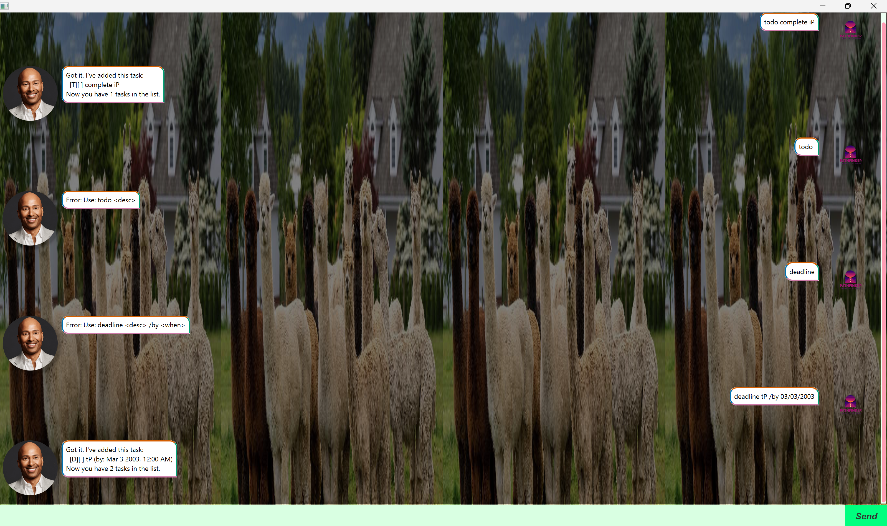

# Jarvis - Your Personal Task Management Assistant

Jarvis is an intelligent task management chatbot built with JavaFX that helps you organize and track your daily tasks, deadlines, events, and places. With an intuitive graphical user interface, Jarvis makes task management simple and efficient.



## Features

### 📝 Task Management
- **Todo Tasks**: Simple tasks without specific dates
- **Deadline Tasks**: Tasks with specific due dates and times
- **Event Tasks**: Tasks with start and end times
- **Place Tasks**: Location-based tasks

### 🔍 Smart Features
- **Search Functionality**: Find tasks by keywords
- **Mark/Unmark**: Track task completion status
- **Delete Tasks**: Remove completed or unwanted tasks
- **List All Tasks**: View all your tasks at a glance
- **Built-in Help**: Interactive help system that guides you through all commands

### 💾 Data Persistence
- Automatic saving of all tasks
- Data persists between application sessions
- Secure local storage

## Quick Start

### Prerequisites
- Java 17 or higher
- JavaFX runtime (included in the JAR)

### Running the Application

**Option 1: Using the JAR file (Recommended)**
```bash
java -jar ip-all.jar
```

**Option 2: Using Gradle**
```bash
./gradlew run
```

## Commands Guide

When you start Jarvis, a help message will automatically appear showing all available commands:

### Basic Commands
| Command | Format | Example |
|---------|--------|---------|
| **Help** | `help` | `help` |
| **List Tasks** | `list` | `list` |
| **Exit** | `bye` | `bye` |

### Task Creation
| Task Type | Format | Example |
|-----------|--------|---------|
| **Todo** | `todo <description>` | `todo Buy groceries` |
| **Deadline** | `deadline <description> /by <date time>` | `deadline Submit report /by 2/12/2023 1800` |
| **Event** | `event <description> /from <start> /to <end>` | `event Team meeting /from 2/12/2023 1400 /to 2/12/2023 1500` |
| **Place** | `place <description> /at <location>` | `place Dentist appointment /at Downtown Clinic` |

### Task Management
| Command | Format | Example |
|---------|--------|---------|
| **Mark Done** | `mark <task number>` | `mark 1` |
| **Mark Undone** | `unmark <task number>` | `unmark 1` |
| **Delete** | `delete <task number>` | `delete 2` |
| **Find** | `find <keyword>` | `find meeting` |

### Date Format
Use the format: `d/M/yyyy HHmm`
- Example: `2/12/2023 1800` (2nd December 2023, 6:00 PM)

## Development Setup

### Using IntelliJ IDEA
1. **Prerequisites**: JDK 17, latest IntelliJ IDEA
2. Open IntelliJ → `File` → `Open` → Select project directory
3. Configure JDK 17 in Project Settings
4. Run `src/main/java/jarvis/Launcher.java`

### Using VS Code
1. **Prerequisites**: JDK 17, VS Code with Java Extension Pack
2. Open project folder in VS Code
3. Run using: `./gradlew run`

### Building the Project
```bash
# Clean and build
./gradlew clean build

# Create executable JAR
./gradlew shadowJar
```

The executable JAR will be created at `build/libs/ip-all.jar`

## Project Structure
```
src/
├── main/java/jarvis/
│   ├── commands/          # Command implementations
│   ├── parser/            # Input parsing
│   ├── storage/           # Data persistence
│   ├── tasks/             # Task models
│   ├── ui/                # User interface logic
│   ├── DialogBox.java     # GUI dialog components
│   ├── MainWindow.java    # Main GUI controller
│   ├── Jarvis.java        # Core application logic
│   └── Launcher.java      # Application entry point
└── main/resources/
    ├── css/               # Stylesheets
    ├── images/            # UI images
    └── view/              # FXML layouts
```

## Technologies Used
- **Java 17**: Core programming language
- **JavaFX**: GUI framework
- **Gradle**: Build automation
- **JUnit**: Testing framework

## Contributing
1. Fork the repository
2. Create a feature branch
3. Make your changes
4. Add tests if applicable
5. Submit a pull request

## License
This project is part of the CS2103T Software Engineering course at NUS.

---

**"Hello! I'm Jarvis, your task management assistant!"** 🤖
