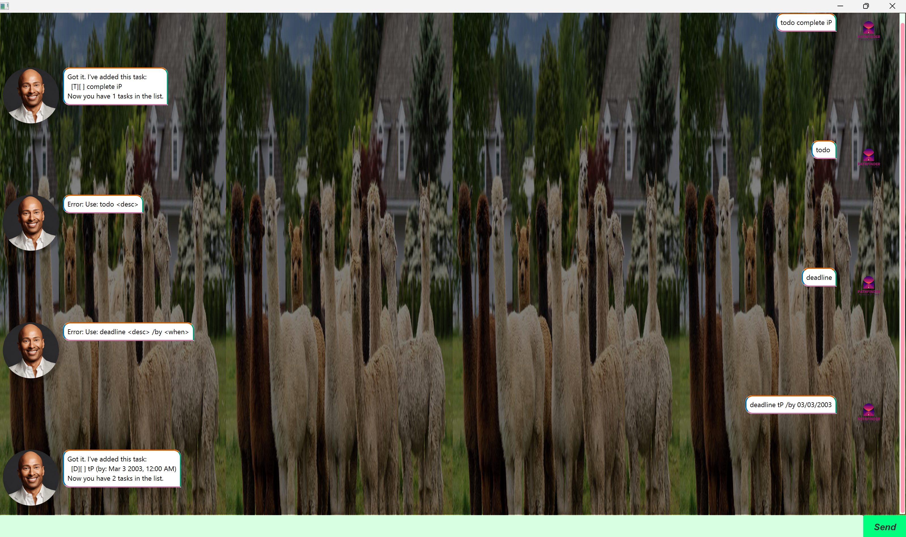

# Jarvis User Guide



A personalised chatbot to help you track your tasks!

## Adding deadlines

Here you can add deadline tasks

Example: `deadline <desc> /by DD/MM/YYYY <HH:mm>`

```
Deadline task should be now added and be reflected with the chatbot informing you it's been added
```

## Adding events
Here you can add event tasks with a start and end time

Example: `event <desc> /from DD/MM/YYYY <HH:mm> /to DD/MM/YYYY <HH:mm>`

```
Event task should be now added and be reflected with the chatbot informing you it's been added
```


## Add Place
Here you can add a place to a task for better tracking

Example: `place <task_number> /at <location>`

```
Place should be added to the specified task and reflected with the chatbot informing you it's been added
```

## Find keyword
Here you can search for tasks containing a given keyword

Example: `find <keyword>`

```
All tasks matching the keyword will be listed by the chatbot
```

## Delete items
Here you can delete a task from the list

Example: `delete <task_number>`

```
The specified task will be removed and the chatbot will confirm its deletion
```

## List tasklist
Here you can view all tasks currently tracked

Example: `list`
```
All tasks will be displayed with their status and details
```

## Mark task as done
Here you can mark a task as completed

Example: `done <task_number>`

```
The specified task will be marked as done and reflected with the chatbot informing you it's completed
```

## Mark task as undone (unmark)
Here you can unmark a task that was previously completed

Example: `unmark <task_number>`
```
The specified task will be marked as not done and reflected with the chatbot informing you
```

## Exit programme
Here, you can close the chatbot application

Example: `bye`

```
The chatbot will display a farewell message and the programme will exit
```